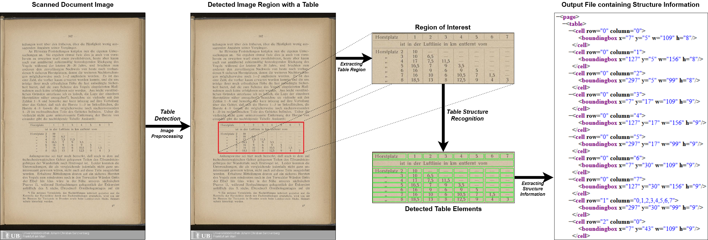
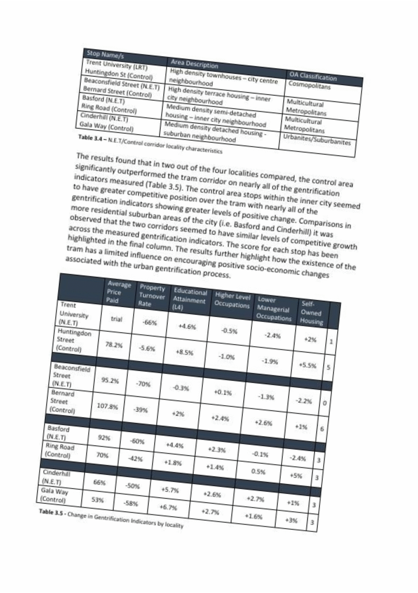
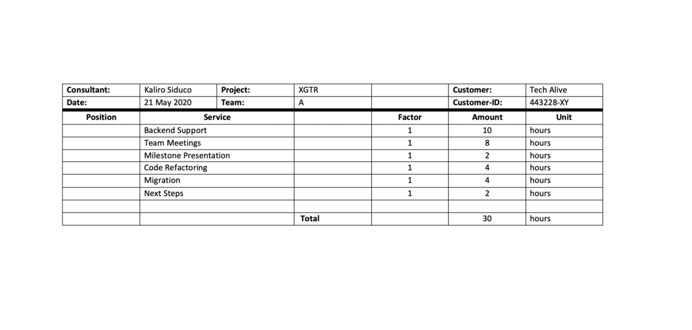
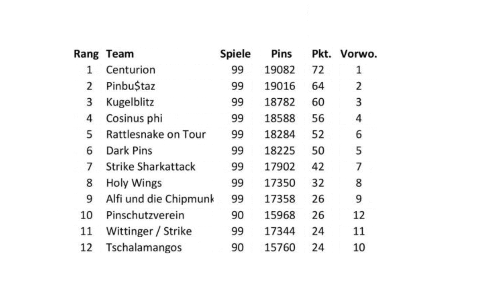
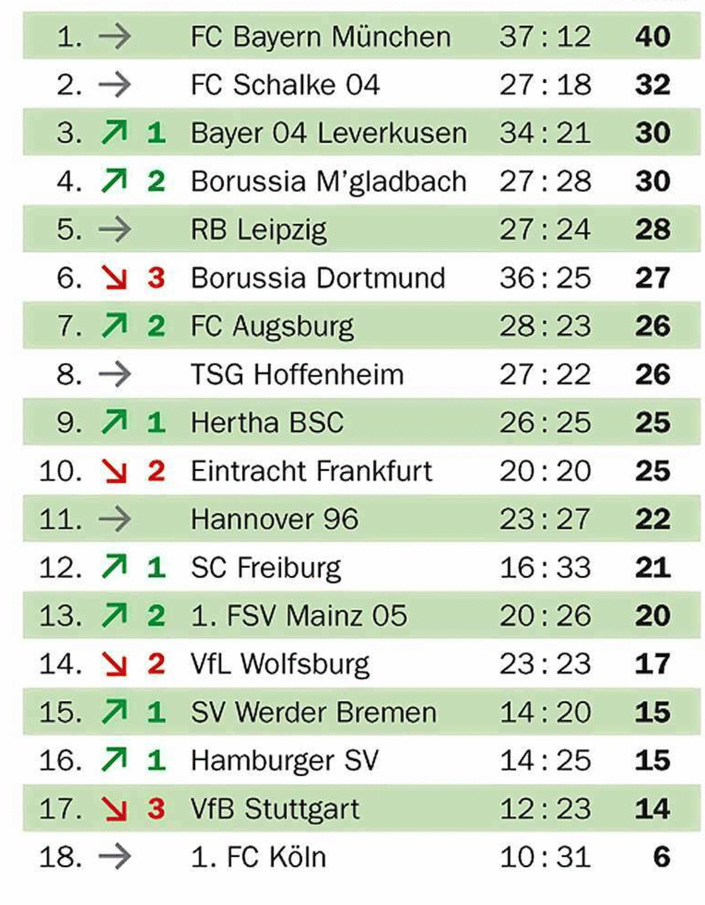

# Multi-Type-TD-TSR
Check it out on <a href="https://colab.research.google.com/github/Psarpei/Multi_Type_TD_TSR/blob/main/Table_Recognition.ipynb">
  
</a>
Source Code of our Paper:
[Multi-Type-TD-TSR](https://arxiv.org/abs/2105.11021) Extracting Tables from Document Images using a Multi-stage Pipeline for Table Detection and Table Structure Recognition

# Description


## Multi-Type-TD-TSR the Whole Pipeline 

As global trends are shifting towards data-driven industries, the demand for automated algorithms that can convert digital images of scanned documents into machine readable information is rapidly growing. Besides the opportunity of data digitization for the application of data analytic tools, there is also a massive improvement towards automation of processes, which previously would require manual inspection of the documents. Although the introduction of optical character recognition (OCR) technologies mostly solved the task of converting human-readable characters from images into machine-readable characters, the task of extracting table semantics has been less focused on over the years. The recognition of tables consists of two main tasks, namely table detection and table structure recognition. Most prior work on this problem focuseson either task without offering an end-to-end solution or paying attention to real application conditions like rotated images or noise artefacts inside the document image. Recent work shows a clear trend towards deep learning approaches coupled with the use of transfer learning for the task of table structure recognition due to the lack of sufficiently large datasets. In this paper we present a multistage pipeline named Multi-Type-TD-TSR, which offers an end-to-end solution for the problem of table recognition. It utilizes state-of-the-art deep learning models for table detection and differentiates between 3 different types of tables based on the tables’ borders. For the table structure recognition we use a deterministic non-data driven algorithm, which works on all table types. We additionally present two algorithms. One for unbordered tables and one for bordered tables, which are the base of the used table structure recognition algorithm. We evaluate Multi-Type-TD-TSR on the ICDAR 2019 table structure recognition dataset and achieve a new state-of-the-art. 

## Multi-Type-TD-TSR on Fully Bordered Tables 

For TSR on fully bordered tables, we use the erosion and dilation operation to extract the row-column grid cell image without any text or characters. The erosion kernels are generally thin vertical and horizontal strips that are longer than the overall font size but shorter than the size of the smallest grid cell and, in particular, must not be wider than the smallest table border width. Using these kernel size constraints results in the erosion operation removing all fonts and characters from the table while preserving the table borders. In order to restore the original line shape, the algorithm applies the dilation operation using the same kernel size on each of the two eroded images, producing an image with vertical and a second with horizontal lines. Finally, the algorithm combines both images by using a bit-wise ```or``` operation and re-inverting the pixel values to obtain a raster cell image. We then use the contours function on the grid-cell image to extract the bounding-boxes for every single grid cell.

## Multi-Type-TD-TSR on Unbordered Tables 

The TSR algorithm for unbordered tables works similarly to the one for bordered tables but utilizes the erosion operation in a different way. The erosion kernel is in general a thin strip with the difference that the horizontal size of the horizontal kernel includes the full image width and the vertical size of the vertical kernel the full image height. The algorithm slides both kernels independently over the whole image from left to right for the vertical kernel, and from top to bottom for the horizontal kernel. During this process it is looking for empty rows and columns that do not contain any characters or font. The resulting images are inverted and combined by a bit-wise ```and``` operation producing the final output. The output is a grid-cell image similar to the one from TSR for bordered tables, where the overlapping areas of the two resulting images represent the bounding-boxes for every single grid cell.

## Multi-Type-TD-TSR on Partially Bordered Tables 

The main goal of our algorithms for bordered and unbordered tables is to create a grid cell image by adding borders in the unbordered case and detecting lines in the bordered case. If a table is only partially bordered, then the unbordered algorithm is prevented to add borders in orthogonal direction to the existing borders, while the bordered algorithm can only find the existing borders. Both approaches result in incomplete grid cell images. 
<br/>
<br/>
<br/>
TSR for partially bordered tables uses the same erosion algorithm as in bordered tables to detect existing borderes, but without using them to create a grid cell, but to delete the borders from the table image to get an unbordered table. This allows for applying the algorithm for unbordered tables to create the grid-cell image and contours by analogy to the variants discussed above. A key feature of this approach is that it works with both bordered and unbordered tables: it is type-independent.
<br/>
<br/>

<p>&nbsp;</p>

<p>&nbsp;</p>

<p>&nbsp;</p>

<p>&nbsp;</p>

<p>&nbsp;</p>

# Table Structure Recognition Results
## ICDAR 19 (Track B2)

|                 | IoU | IoU | IoU | IoU | Weighted|
 -----------------|:---:|-----|-----|-----|---------
|Team             | 0.6 | 0.7 | 0.8 | 0.9 | Average |
|CascadeTabNet    |0.438|0.354|0.19 |0.036|  0.232  |
|NLPR-PAL         |0.365|0.305|0.195|0.035|  0.206  |
|Multi-Type-TD-TSR|0.589|0.404|0.137|0.015|  0.253  |

# Instructions
## Configurations
The source code is developed under the following library dependencies

* PyTorch = 1.7.0
* Torchvision = 0.8.1
* Cuda = 10.1
* PyYAML = 5.1

## Detectron 2
The table detection model is based on [detectron2](https://github.com/facebookresearch/detectron2) follow this [installation guide](https://detectron2.readthedocs.io/en/latest/tutorials/install.html) to setup.

## Image Alignment Pre-Processing
For the image alignment pre-processing step there is one script available:

*  ```deskew.py```

To apply the image alignment pre-processing algorithm to all images in one folder, you need to execute:

    python3 deskew.py

with the following parameters

* ```--folder``` the input folder including document images
* ```--output``` the output folder for the deskewed images

## Table Structure Recognition (TSR)
For the table structure recognition we offer a simple script for different approaches

* ```tsr.py```

To apply a table structure recognition algorithm to all images in one folder, you need to execute:

    python3 tsr.py

with the following parameters

* ```--folder``` path of the input folder including table images
* ```--type``` the table structure recognition type ```type in ["borderd", "unbordered", "partially", "partially_color_inv"] ```
* ```--img_output``` output folder path for the processed images
* ```--xml_output``` output folder path for the xml files including bounding boxes

## Table Detection and Table Structure Recognition (TD & TSR)

To appy the table detection with a followed table structure recogniton 

* ```tdtsr.py```

To apply a table structure recognitio algorithm to all images in one folder, you need to execute:

    python3 tdtsr.py

with the following parameters

* ```--folder``` path of the input folder including table images
* ```--type``` the table structure recognition type ```type in ["borderd", "unbordered", "partially", "partially_color_inv"] ```
* ```--tsr_img_output``` output folder path for the processed table images
* ```--td_img_output``` output folder path for the produced table cutouts
* ```--xml_output``` output folder path for the xml files for tables and cells including bounding boxes
* ```--config``` path of detectron2 configuration file for table detection
* ```--yaml``` path of detectron2 yaml file for table detection
* ```--weights``` path of detectron2 model weights for table detection

## Evaluation
To evaluate the table structure recognition algorithm we provide the following script:

*  ```evaluate.py```

to apply the evaluation the table images and their labels in xml-format have to be the same name and should lie in a single folder.
The evaluation could be started by:

    python3 evaluate.py
  
with the following parameter

* ```--dataset``` dataset folder path containing table images and labels in .xml format

# Get Data

*  test dataset for table structure recognition including table images and annotations can be downloaded [here](https://drive.google.com/drive/folders/1COTV5f7dEAA4Txmxy3LVfcNHiPSc4Bmp?usp=sharing) 
* table detection detectron2 model weights and configuration files can be downloaded [here](https://drive.google.com/drive/folders/1ry5C9Qs5lyskZeDzBJNYCbNTN1LH1rjn?usp=sharing)

# Citation
    
    @misc{fischer2021multitypetdtsr,
        title={Multi-Type-TD-TSR - Extracting Tables from Document Images using a Multi-stage Pipeline for Table Detection and Table Structure Recognition: from OCR to Structured Table Representations},
        author={Pascal Fischer and Alen Smajic and Alexander Mehler and Giuseppe Abrami},
        year={2021},
        eprint={2105.11021},
        archivePrefix={arXiv},
        primaryClass={cs.CV}
    }
